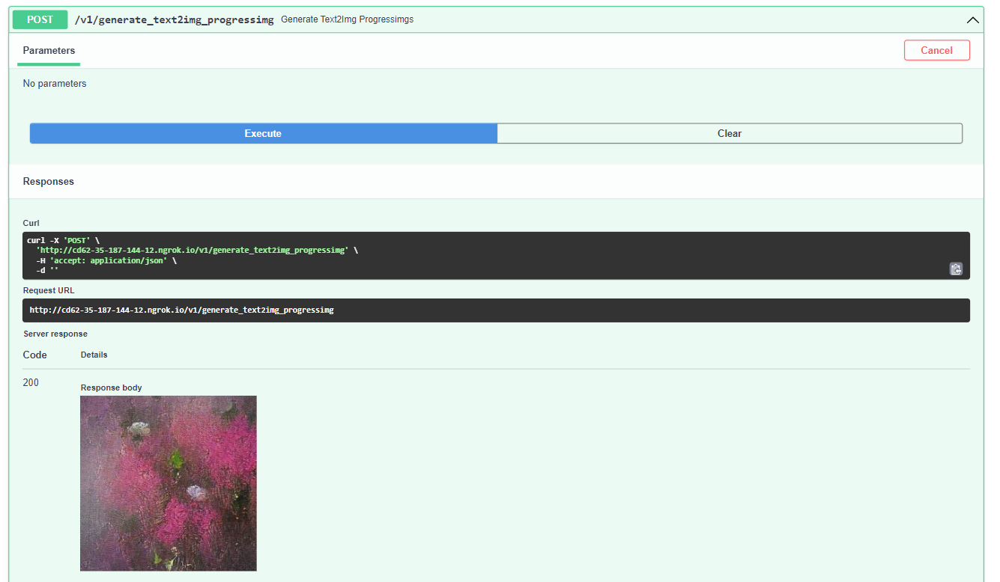

# AI Art Generator API
A streamlined API for the CLIP+VQGAN AI Art Generator using Pytorch and FastAPI

## Overview
This reposistry showcases an API for **CLIP+VQGAN** prompt to image model. It exposes the model's endpoints where the user can provide a text for the
model to generate a painting and send it back. The backbone model used is a combination of a generator ([VQGAN](https://compvis.github.io/taming-transformers/)) and critic ([CLIP](https://openai.com/blog/clip/)). The generator is a VQGAN model, short for Vector Quantized Generative Adversarial Network and the critic is a CLIP model short for Contrastive Image-Language Pretraining. The critic is a ViT-B/32 Transformer architecture which works as an image encoder and uses a masked self-attention Transformer as a text encoder. In this project, we will be using the weights pretrained on the wikiart dataset.
<br> These encoders are trained to maximize the similarity of (image, text) pairs via a contrastive loss. The generator will generate an image and the critic will measure how well the image matches the text. Then, the generator uses the feedback from the critic model to generate more accurate images. This iteration will be done many times until the CLIP score becomes high enough and the generated image matches the text. 


[Source: The Illustrated VQGAN by LJ Miranda](https://ljvmiranda921.github.io/notebook/2021/08/08/clip-vqgan/)

## Setup
The image generation process is computationally expensive and requires strong computational power. We will be using the Google Colab platform to run the model.
<br>
To run the API, open the Text to Art GAN notebook found [here](https://github.com/anisdismail/AI-Art-Generator-API/blob/main/Text_to_Art_GAN.ipynb) and follow the instructions there. <br>
Once the API is successfully running, you will obtain a public URL that you can use in your application with the following format: 
```
http://-----------------.ngrok.io
```

## API Endpoints
To see all available endpoints, open your favorite browser and navigate to:

```
http://-----------------.ngrok.io/docs
```

The API endpoints are divided as follows:
#### /v1/generate_text2img (POST)


This service allows the other services to interact with the GAN model and provide it with text and the desired image size to generate paintings. Once this service is called, the model will be running in a separate thread to fine tune the image generator. As the generator is being finetuning, the model will save intermediary images of the painting that the user asked for. <br>

#### /v1/generate_text2img_progressimg (POST) 

This service will allow the other services to access the latest intermediary image generated by the model in its finetuning process.
<br>

#### /v1/generate_text2img_progressbar (POST)


 
This service will allow the other services to access the current number of iterations the model has finished so far in its finetuning process. This service is useful to show the user the time left for the model to finish the painting generation.

#### /v1/generate_textimg2img (POST): 


This service allows the other services to interact with the GAN model and provide it in addition to text with a starting image to generate an edited painting based on this image. Once this service is called, the model will be running in a separate thread to fine tune the image generator. As the generator is being finetuning, the model will save intermediary images of the painting that the user asked for. 


## Benchmarks
To test the performance of the GAN model, we compared the generation time as the size of the output image increases. The experiments were done on Google Colab on an Nvidia T4 GPU, and the input prompt is: “flowering magenta orchids in a rainy day impressionist”.

| Image Size | Generation Time (seconds) |
|:-----------:|:----------------------------:|
| 64x64 | 55.832 |
| 128x128 | 58.245 |
| 256x256 | 101.637 |
| 512x512 | 232.239 |

## Acknowledgments
The original notebook was made by [Katherine Crowson](https://github.com/crowsonkb).
With further modifications by [Justin John](https://colab.research.google.com/github/justinjohn0306/VQGAN-CLIP/blob/main/VQGAN%2BCLIP_%28z%2Bquantize_method_with_augmentations%2C_user_friendly_interface%29.ipynb#scrollTo=c3d7a8be-73ce-4cee-be70-e21c1210a7a6).
